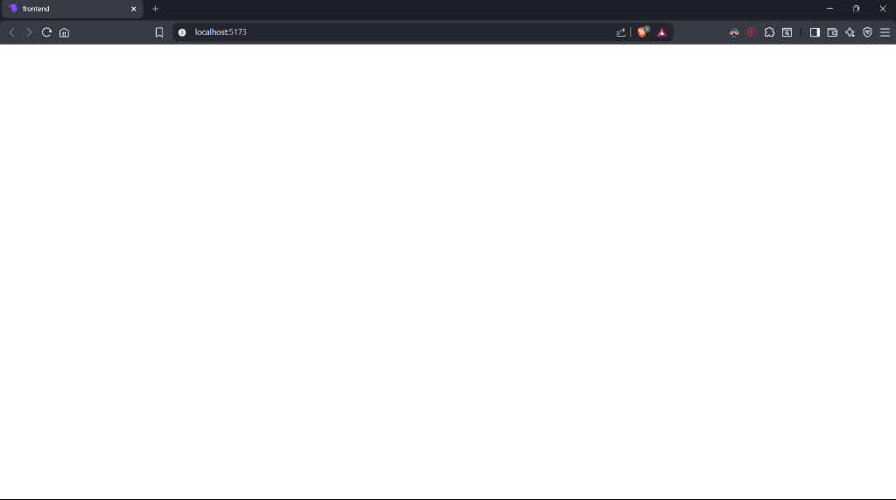
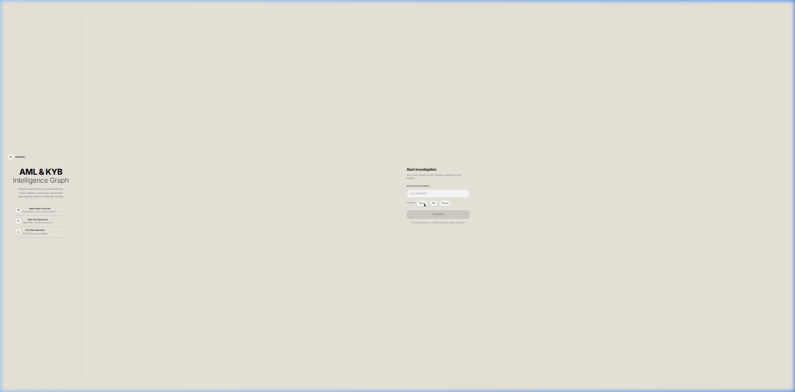
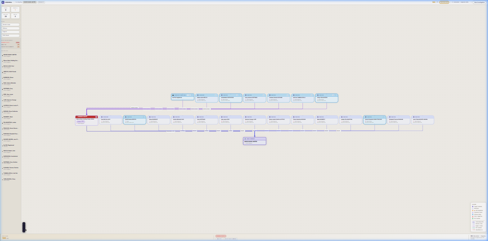

# 🔍 Project Unshell
### Autonomous AML & KYB Intelligence Graph

> **Hackfest 2026 · Team technorev · NMAMIT**

[](https://fastapi.tiangolo.com)
[](https://react.dev)
[](https://langchain-ai.github.io/langgraph/)
[](https://python.org)

---

## What is Project Unshell?

Financial criminals don't walk through the front door. They hide behind **layers of shell companies, nominee directors, and offshore trusts** — making it nearly impossible for a compliance analyst to trace the real beneficial owner.

**Project Unshell** is a fully autonomous AML & KYB (Know Your Business) investigation platform. You give it a UK Company Registration Number. It returns a **complete, evidence-backed forensic ownership graph** — with risk scores, sanctions flags, and circular loop detection — in under 10 seconds.

> A task that takes a senior compliance analyst **3 days** takes Unshell less than **10 seconds**.

---

## The Problem It Solves

| Manual KYB Today | With Unshell |
|---|---|
| Analyst reads 50-page PDFs manually | Hyper-RAG pipeline extracts ownership automatically |
| Circular loops missed by human eye | `nx.simple_cycles()` detects mathematically |
| Nominee directors not flagged | Director density algorithm fires NOMINEE_PUPPET |
| OFAC check done separately | Built-in fuzzy SDN match, score → 100 instantly |
| No source evidence | Every claim links to exact PDF page + chunk |
| Days of work | Under 10 seconds |

---

## Architecture

The investigation runs as a **7-node LangGraph stateful pipeline**:

```
CRN Input
    │
    ▼
[1] input_router          — Sets thread ID, marks status in_progress
    │
    ▼
[2] fetch_uk_api          — Companies House REST API: profile, PSCs, officers, filings
    │
    ▼
[3] depth_expand          — Recursively fetches every corporate PSC's own ownership tree (Level 2)
    │
    ▼
[4] cleanup_graph         — Removes floating orphan nodes, tags the resolved UBO node
    │
    ▼
[5] calculate_risk        — NetworkX math engine: circular loops, puppet directors, offshore flags
    │
    ▼
[6] sanctions_check       — RapidFuzz fuzzy match against local OFAC SDN SQLite database
    │
    ▼
[7] compile_output        — Builds final JSON payload: graph, risk score, flags, evidence
    │
    ▼
  API Response → React Flow UI
```

### The Hyper-RAG Pipeline (Document Mode)
When an offshore PDF is uploaded, a 4-stage RAG pipeline activates:

```
PDF Upload
  │
  ▼
[R1] PyMuPDF Ingest       — Extracts raw text blocks page by page
  │
  ▼
[R2] FAISS Index          — Chunks text, embeds with Sentence Transformers, builds vector index
  │
  ▼
[R3] NVIDIA Mistral (NIM) — Semantically queries index for ownership entities and relationships
  │
  ▼
[R4] RapidFuzz Firewall   — Every AI claim cross-verified against raw PDF chunks.
                            Zero-Trust: unverified claim → silently dropped.
```

---

## Risk Scoring Engine

The `NetworkX` graph engine runs **6 deterministic risk vectors** — pure math, zero AI opinion:

| Flag | Trigger | Score Impact |
|---|---|---|
| `CIRCULAR_LOOP` | `nx.simple_cycles()` detects ownership cycle | +100 (Fatal) |
| `NOMINEE_PUPPET` | Director appointed across 100+ companies | +75 (Fatal) |
| `OFAC_MATCH` | RapidFuzz match on US Treasury SDN list | Score → 100 |
| `OFFSHORE_WALL` | PSC jurisdiction outside UK/EEA | +30 |
| `AGED_SHELL` | Incorporation >10yrs, <5 filings | +15 |
| `VAGUE_SIC` | High-risk SIC code (74990, 99999) | +10 |

**Score thresholds:** `< 30` Auto-Approve · `30–64` Human Review · `65–94` Auto-Reject · `≥ 95` SAR Filing Required

---

## Tech Stack

| Layer | Technology |
|---|---|
| **Frontend** | React 18 + Vite, React Flow (ownership graph), vanilla CSS |
| **Backend** | FastAPI + asyncio, Uvicorn |
| **Orchestration** | LangGraph (stateful 7-node workflow, pause/resume) |
| **AI Extraction** | NVIDIA NIM Mistral (structured entity extraction) |
| **PDF Reading** | Google Gemini 2.5 Flash (document mode) |
| **RAG Engine** | PyMuPDF + Sentence Transformers + FAISS |
| **Verification** | RapidFuzz token-sort firewall (Zero-Trust AI) |
| **Graph Math** | NetworkX (topology, cycle detection, centrality) |
| **Sanctions** | SQLite OFAC SDN database (local, offline) |
| **Data Broker** | FastMCP server (port 8002) — zero credential leakage |

---

## Project Structure

```
unshell/
├── backend/
│   ├── main.py                  # FastAPI entry point
│   ├── agent/
│   │   ├── orchestrator.py      # LangGraph 7-node pipeline
│   │   └── state.py             # InvestigationState TypedDict
│   ├── ai/
│   │   ├── fetch_ch.py          # Companies House API client
│   │   ├── ch_parser.py         # PSC/officer → graph node parser
│   │   └── gemini_extractor.py  # Gemini PDF extraction (doc mode)
│   ├── graph/
│   │   └── engine.py            # NetworkX risk scoring engine
│   ├── mcp/
│   │   └── server.py            # FastMCP credential broker
│   ├── data/
│   │   └── sanctions.db         # OFAC SDN SQLite database
│   └── requirements.txt
│
└── frontend/
    └── src/
        ├── App.jsx
        ├── api/client.js        # Backend API calls
        └── components/
            ├── DualEntryGateway.jsx   # Landing / CRN input
            ├── LoadingScreen.jsx      # Investigation progress UI
            ├── InvestigationView.jsx  # Main dashboard
            ├── CustomNode.jsx         # React Flow graph node
            └── RiskScoreboard.jsx     # Risk score bottom bar
```

---

## Setup & Running Locally

### Prerequisites
- Python 3.11+
- Node.js 18+
- API keys (see below)

### 1. Clone & configure

```bash
git clone <repo-url>
cd unshell
```

Create `backend/.env`:

```env
COMPANIES_HOUSE_API_KEY=your_key_here
GEMINI_API_KEY=your_key_here
NVIDIA_API_KEY=your_key_here
```

### 2. Backend

```bash
cd backend
pip install -r requirements.txt
python -m uvicorn main:app --port 8001
```

### 3. MCP Server (separate terminal)

```bash
cd backend
python mcp/server.py
```

### 4. Frontend

```bash
cd frontend
npm install
npm run dev
```

Open **http://localhost:5173**

### Demo CRNs to Try

| Company | CRN | Expected Result |
|---|---|---|
| Monzo Bank | `09446231` | Low risk, clean structure |
| IBS Group | `01683457` | Medium risk |
| Seabon Ltd | `06026625` | Critical — OFAC linked |

---

## API Reference

| Endpoint | Method | Description |
|---|---|---|
| `/health` | GET | Service health check |
| `/investigate` | POST | `{ "crn": "09446231" }` → full investigation |

---

## How to Get API Keys

| Key | Where to Get |
|---|---|
| Companies House | [developer.company-information.service.gov.uk](https://developer.company-information.service.gov.uk) — free |
| Gemini | [aistudio.google.com](https://aistudio.google.com) — free tier |
| NVIDIA NIM | [build.nvidia.com](https://build.nvidia.com) — free credits |

---

## Screenshots

### 1. Landing Page — Start an Investigation

Enter any UK Company Registration Number (CRN) and hit **Investigate**. Three demo companies are pre-loaded — Monzo (low risk), IBS (medium), and Seabon (critical OFAC-linked) — so you can jump straight into a live investigation. The system runs entirely off the UK Companies House public API with no manual data entry required.



---

### 2. Investigation in Progress — Live Pipeline View

Once you submit a CRN, Unshell's 6-stage autonomous pipeline kicks in. The screen shows each step completing in real time — from fetching the company registry, building the ownership graph, running cycle detection, all the way to an OFAC sanctions screen. The orbital spinner on the left indicates the pipeline is actively running. Progress is shown as a step counter (e.g. `3/6`).



---

### 3. Full Forensic Dashboard — SATUS 2026-1 PLC

This is the complete investigation output. In this example, **SATUS 2026-1 PLC** returned a **Risk Score of 90/100** triggering an **AUTO REJECT** verdict. The graph reveals a classic nominee puppet structure — a holding company (Satus 2026-1 Holdings Limited) flagged as a `NOMINEE PUPPET` holds over 75% shares, controlled by a corporate director network including Maplesfs UK entities. The left sidebar shows all 6 entities, 1 puppet detected, depth-2 chain traced, and the exact rejection rationale. Every edge on the graph is clickable, showing the source evidence behind that relationship.



---

## Team

**Team technorev · NMAMIT · Hackfest 2026**

| Role | Name |
|---|---|
| Backend / LangGraph | Srihari BT |
| Frontend / React Flow | _(add names)_ |
| RAG Pipeline | _(add names)_ |

---

## License

MIT © 2026 Team technorev
