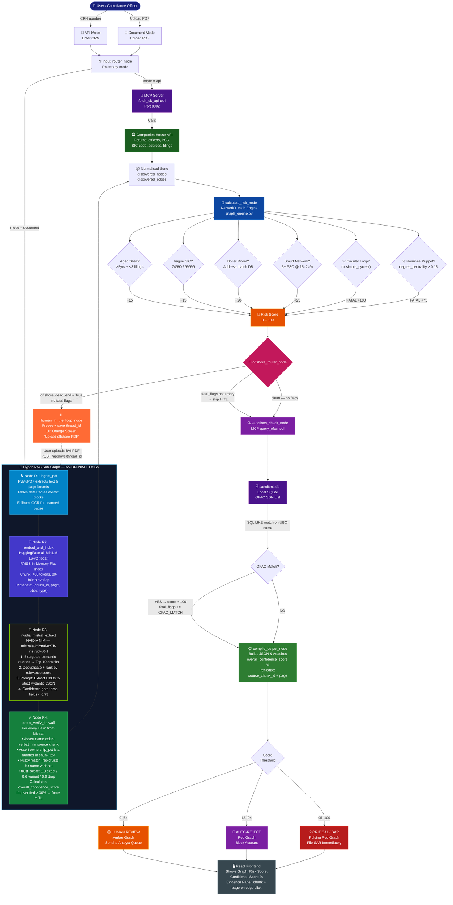

# Project Fusion 2.0 — Hyper-RAG LangGraph Architecture
## Zero-Hallucination PDF Intelligence for AML/KYB — NVIDIA NIM + FAISS Edition

**Document Type:** Senior AI Engineering Design Spec  
**Version:** 3.0 (Hyper-RAG Pivot)  
**Scope:** Replacing single-shot Gemini Vision with a grounded, verifiable, 4-node Hyper-RAG sub-graph using NVIDIA NIM (Mistral) + FAISS inside LangGraph. Adaptable to Indian and UK corporate PDFs out of the box.

---

## 1. HONEST ASSESSMENT — Why You Have a Hallucination Problem Right Now

Your previous architecture sent a raw PDF as bytes to Gemini in one shot and trusted the output. For a hackathon demo, this is fine. For a compliance officer signing off on AML decisions, it is not.

**What goes wrong with real-world corporate PDFs (India + UK):**

| Problem | What a Single-Shot LLM Does | Consequence for AML |
|---|---|---|
| Long context dilution (>15 pages) | Attends less to pages 20–50 | Ownership % from late pages wrong or missing |
| Repeated entity names | Confuses "Premier Ltd (UK)" vs "Premier Ltd (BVI)" | Graph edges point to wrong nodes |
| Scanned / low-res pages | Hallucinates plausible-sounding text | Fabricated UBO names pass sanctions check |
| Tables spanning pages | Misreads column alignment | Ownership % swapped between entities |
| Legal boilerplate (MOA, AOA, SHA) | Treats standard clauses as ownership claims | False edges injected into NetworkX |
| Multi-language / Indic PDFs | Translates loosely, invents proper nouns | Wrong names sent to OFAC |
| MCA21 / ROC filings (India) | Non-standard date/address formats | Parsing failures, silent data loss |

**Bottom line:** A single-pass multimodal call is a research demo, not a production AML engine. Every extracted fact needs a retrievable, page-cited source chunk. That is exactly what the Hyper-RAG pipeline delivers.

---

## 2. THE SOLUTION — The Hyper-RAG Sub-Graph (4 Nodes)

The old `extract_pdf_node` (one node calling Gemini) is **completely replaced** by a **four-node RAG sub-graph** running inside LangGraph. The rest of the system — NetworkX math engine, MCP server, OFAC sanctions check — is completely unchanged.

### Core Principle

> **No fact enters the NetworkX graph unless it has a retrievable FAISS source chunk with a page number and a confidence score above 0.75. NVIDIA NIM (Mistral) sees ONLY retrieved chunks — never the full PDF.**

This is not RAG for question-answering. This is RAG for **structured extraction with evidence provenance** — the architecture that AML regulators actually want to see.

### Why NVIDIA NIM (Mistral Mixtral 8x7B) Over Gemini for This Task

| Factor | Gemini Vision (Old) | NVIDIA NIM Mistral (New) |
|---|---|---|
| Grounding | Sees full PDF, hallucinates freely | Sees only FAISS-retrieved chunks |
| JSON reliability | Inconsistent with long context | Instruction-tuned for strict JSON |
| Latency budget | Variable (network + multimodal) | Sub-5s on retrieved chunks only |
| Cost at scale | Per-token on full PDF | Per-token on small chunk window |
| India/UK PDF flexibility | Depends on OCR quality | Independent — text extracted by PyMuPDF first |

### Why FAISS Over ChromaDB for This Task

- **Zero infrastructure** — FAISS runs fully in-process, in-memory, no server, no port
- **Speed** — flat index search on <500 chunks is sub-millisecond
- **Hackathon-safe** — no service to spin up, no version conflicts, single `pip install faiss-cpu`
- **LangChain native** — `FAISS.from_texts()` in one line with HuggingFace embeddings

---

## 3. FULL ARCHITECTURE — MERMAID DIAGRAM



---

## 4. THE FOUR RAG NODES — DETAILED SPEC

### Node R1: `ingest_pdf` (PyMuPDF Extraction)

**Library:** `pymupdf` (fitz) — handles text-layer PDFs, mixed PDFs, and tables.  
**India/UK Flexibility:** Detects empty text layers (scanned docs) and falls back gracefully with a warning rather than crashing.

```python
import fitz  # pymupdf

def ingest_pdf(state: InvestigationState) -> dict:
    doc = fitz.open(stream=state["raw_pdf_bytes"], filetype="pdf")
    raw_blocks = []
    total_chars = 0

    for page_num, page in enumerate(doc):
        # Extract structured text blocks with bounding boxes
        page_dict = page.get_text("dict", flags=fitz.TEXT_PRESERVE_WHITESPACE)
        
        for block in page_dict["blocks"]:
            if block["type"] == 0:  # text block
                text = " ".join(
                    span["text"]
                    for line in block["lines"]
                    for span in line["spans"]
                ).strip()
                if len(text) < 10:
                    continue  # skip noise / header artifacts
                raw_blocks.append({
                    "page": page_num + 1,
                    "bbox": block["bbox"],
                    "text": text,
                    "type": "text"
                })
                total_chars += len(text)

        # Tables: detect and preserve as atomic markdown chunks
        # (prevents table column values from being split across chunks)
        try:
            for table in page.find_tables():
                md = table.to_markdown()
                if md and len(md.strip()) > 20:
                    raw_blocks.append({
                        "page": page_num + 1,
                        "bbox": table.bbox,
                        "text": md,
                        "type": "table"
                    })
                    total_chars += len(md)
        except Exception:
            pass  # some PDFs have no table structure — graceful skip

    # Scanned PDF detection: warn if text layer is nearly empty
    warnings = []
    if total_chars < 200 and len(doc) > 0:
        warnings.append(
            f"PDF appears to be scanned or image-only ({total_chars} chars extracted). "
            "OCR quality may be low. Consider uploading a text-layer PDF."
        )

    return {
        "raw_blocks": raw_blocks,
        "rag_warnings": warnings,
        "total_pages": len(doc)
    }
```

**India/UK Adaptation Notes:**
- MCA21 ROC filings: usually text-layer PDFs, works perfectly
- UK Companies House certified extracts: text-layer, works perfectly
- BVI/Cayman incorporation certs: often scanned — warning is surfaced to UI
- MOA/AOA/SHA documents: heavy tables — table extraction handles these

---

### Node R2: `embed_and_index` (HuggingFace + FAISS)

**Chunking Strategy (Medium Complexity, High Effectiveness):**

The core insight: corporate PDFs have two content types that need different treatment.
- **Tables** → always atomic (one chunk, never split). A table row with "Premier Directors Ltd | 100%" must not be bisected.
- **Prose** → sentence-aware split at 400 tokens, 80-token overlap. The overlap catches ownership statements that straddle paragraph boundaries.

**400 tokens / 80 overlap** is the sweet spot for this domain:
- 400 = fits comfortably in NVIDIA NIM context window alongside 9 other chunks
- 80 overlap = ~2–3 sentences, enough to preserve cross-sentence ownership claims
- Total FAISS search space: a 20-page corporate PDF → ~60–120 chunks, sub-ms retrieval

```python
from langchain_huggingface import HuggingFaceEmbeddings
from langchain_community.vectorstores import FAISS
from langchain.text_splitter import RecursiveCharacterTextSplitter

def embed_and_index(state: InvestigationState) -> dict:
    # ── Embedding model: local, no API key, multilingual-aware ──
    # all-MiniLM-L6-v2: fast (22ms/chunk), 384-dim, strong on English
    # For Indian PDFs with mixed Hindi/English, swap to:
    # "sentence-transformers/paraphrase-multilingual-mpnet-base-v2"
    embeddings = HuggingFaceEmbeddings(
        model_name="sentence-transformers/all-MiniLM-L6-v2",
        model_kwargs={"device": "cpu"},
        encode_kwargs={"normalize_embeddings": True}
    )

    splitter = RecursiveCharacterTextSplitter(
        chunk_size=400,         # tokens (approx — splitter uses chars, ~4 chars/token)
        chunk_overlap=80,       # 80-token overlap: 2–3 sentence crossover
        length_function=len,
        separators=["\n\n", "\n", ". ", " ", ""]  # paragraph → sentence → word fallback
    )

    texts = []
    metadatas = []
    chunk_id = 0

    for block in state["raw_blocks"]:
        if block["type"] == "table":
            # Tables: always one atomic chunk
            texts.append(block["text"])
            metadatas.append({
                "chunk_id": f"chunk_{chunk_id:04d}",
                "page": block["page"],
                "bbox": str(block["bbox"]),
                "type": "table"
            })
            chunk_id += 1
        else:
            # Prose: sentence-aware split with overlap
            sub_chunks = splitter.split_text(block["text"])
            for sub in sub_chunks:
                if len(sub.strip()) < 20:
                    continue
                texts.append(sub)
                metadatas.append({
                    "chunk_id": f"chunk_{chunk_id:04d}",
                    "page": block["page"],
                    "bbox": str(block["bbox"]),
                    "type": "text"
                })
                chunk_id += 1

    if not texts:
        return {"faiss_index": None, "chunks": [], "rag_warnings": state.get("rag_warnings", []) + ["No text extracted — FAISS index empty"]}

    faiss_index = FAISS.from_texts(texts, embeddings, metadatas=metadatas)

    # Store raw chunks for cross-verification lookup by chunk_id
    chunks = [{"chunk_id": m["chunk_id"], "text": t, **m} for t, m in zip(texts, metadatas)]

    return {
        "faiss_index": faiss_index,
        "chunks": chunks,
        "total_chunks": len(chunks)
    }
```

---

### Node R3: `nvidia_mistral_extract` (NVIDIA NIM — Mistral Mixtral 8x7B)

**Model:** `mistralai/mixtral-8x7b-instruct-v0.1` via `api.build.nvidia.com`  
**Why Mixtral 8x7B for this task:**
- MoE architecture: high reasoning quality at moderate latency
- Excellent instruction-following for strict JSON schemas
- Strong performance on legal/financial English (corporate document language)
- NVIDIA NIM endpoint: consistent sub-3s latency on retrieved-chunk-sized prompts

**The 5 Targeted Retrieval Queries (Creative Design — Optimised for India + UK PDFs):**

Each query is semantically crafted to match the vocabulary used in real corporate documents from both jurisdictions:

| Query | Target | India-specific terms | UK-specific terms |
|---|---|---|---|
| Q1 | Beneficial owners & UBOs | "beneficial interest", "promoter", "DIN holder" | "person with significant control", "PSC", "beneficial owner" |
| Q2 | Directors & officers | "managing director", "whole-time director", "DIN" | "appointed director", "company secretary", "nominee director" |
| Q3 | Shareholding structure | "equity shares", "paid-up capital", "demat account" | "ordinary shares", "ownership band", "allotted shares" |
| Q4 | Offshore / jurisdiction flags | "foreign national", "NRI", "Mauritius", "Singapore" | "BVI", "Cayman", "offshore", "Isle of Man" |
| Q5 | Address & incorporation | "registered office", "CIN number", "ROC" | "registered address", "CRN", "Companies House" |

```python
from langchain_nvidia_ai_endpoints import ChatNVIDIA
from pydantic import BaseModel, Field
from typing import Optional
import json

# ── Pydantic schemas: strict, Mistral-parseable ──

class ExtractedEntity(BaseModel):
    name: str
    entity_type: str          # "company" | "individual" | "trust" | "foundation"
    jurisdiction: Optional[str]
    incorporation_date: Optional[str]
    source_chunk_id: str      # REQUIRED — for cross-verification
    source_page: int          # REQUIRED
    confidence: float = Field(ge=0.0, le=1.0)

class ExtractedRelationship(BaseModel):
    owner: str                # must match an ExtractedEntity.name exactly
    owned: str                # must match an ExtractedEntity.name exactly
    ownership_pct: Optional[float]
    relationship_type: str    # "owns" | "directs" | "nominee_for" | "beneficiary_of"
    evidence_snippet: str     # verbatim quote from chunk, max 200 chars
    source_chunk_id: str      # REQUIRED
    source_page: int          # REQUIRED
    confidence: float = Field(ge=0.0, le=1.0)

class OwnershipExtractionV2(BaseModel):
    entities: list[ExtractedEntity]
    relationships: list[ExtractedRelationship]
    extraction_warnings: list[str]


RETRIEVAL_QUERIES = [
    "beneficial owner percentage shares equity promoter significant control PSC",
    "director officer appointed nominee managing whole-time secretary DIN",
    "shareholder ownership allotted paid-up capital demat ordinary shares",
    "offshore jurisdiction BVI Cayman Mauritius Singapore Isle of Man foreign national NRI",
    "registered address incorporation date CIN CRN registered office ROC Companies House"
]

EXTRACTION_PROMPT = """You are a forensic corporate intelligence analyst extracting UBO (Ultimate Beneficial Owner) data for AML compliance.

RETRIEVED DOCUMENT CHUNKS (these are the ONLY facts you may use):
{retrieved_chunks_formatted}

EXTRACTION RULES — ABSOLUTE AND NON-NEGOTIABLE:
1. Extract ONLY entities and relationships that appear VERBATIM or near-verbatim in the chunks above.
2. For every entity and relationship, you MUST record the exact chunk_id and page_number it came from.
3. If an ownership percentage is not explicitly stated as a NUMBER in the chunks, set ownership_pct to null.
4. If you are uncertain whether two mentions refer to the same entity, treat them as SEPARATE entities.
5. Do NOT infer, extrapolate, or use any prior knowledge. Only use what is in the chunks above.
6. For each extracted fact, assign a confidence: 1.0 = verbatim exact, 0.75-0.99 = clear paraphrase, below 0.75 = do NOT output the field.
7. If a required field (source_chunk_id, source_page) cannot be filled, omit the entire entity/relationship.
8. Legal boilerplate and standard clauses are NOT ownership claims. Ignore them.

OUTPUT FORMAT: Valid JSON only. No markdown. No prose. No backticks. No explanation.

JSON SCHEMA TO FOLLOW EXACTLY:
{schema_json}
"""

def nvidia_mistral_extract(state: InvestigationState) -> dict:
    faiss_index = state["faiss_index"]
    
    if faiss_index is None:
        return {
            "raw_extraction": OwnershipExtractionV2(entities=[], relationships=[], extraction_warnings=["FAISS index was empty — no text to extract from"]),
            "overall_confidence_score": 0.0
        }

    # ── Step 1: Multi-query retrieval (5 queries, top-10 each, deduplicated) ──
    retrieved_chunks = {}  # chunk_id → chunk dict (dedup by chunk_id)
    
    for query in RETRIEVAL_QUERIES:
        results = faiss_index.similarity_search_with_score(query, k=10)
        for doc, score in results:
            cid = doc.metadata.get("chunk_id", "unknown")
            if cid not in retrieved_chunks:
                retrieved_chunks[cid] = {
                    "chunk_id": cid,
                    "page": doc.metadata.get("page", 0),
                    "text": doc.page_content,
                    "type": doc.metadata.get("type", "text"),
                    "relevance_score": float(score)
                }

    # ── Step 2: Rank by relevance, take top-20 to stay within context budget ──
    ranked = sorted(retrieved_chunks.values(), key=lambda x: x["relevance_score"])[:20]

    # ── Step 3: Format chunks for prompt ──
    formatted_chunks = "\n\n".join(
        f"[chunk_id: {c['chunk_id']} | page: {c['page']} | type: {c['type']}]\n{c['text']}"
        for c in ranked
    )

    schema_json = json.dumps(OwnershipExtractionV2.model_json_schema(), indent=2)
    prompt = EXTRACTION_PROMPT.format(
        retrieved_chunks_formatted=formatted_chunks,
        schema_json=schema_json
    )

    # ── Step 4: Call NVIDIA NIM (Mistral) ──
    llm = ChatNVIDIA(
        model="mistralai/mixtral-8x7b-instruct-v0.1",
        temperature=0.0,       # zero temp: deterministic JSON output
        max_tokens=2048,
    )

    response = llm.invoke(prompt)
    raw_text = response.content.strip()

    # ── Step 5: Parse and validate with Pydantic ──
    try:
        # Strip markdown fences if model adds them despite instructions
        if raw_text.startswith("```"):
            raw_text = raw_text.split("```")[1]
            if raw_text.startswith("json"):
                raw_text = raw_text[4:]
        
        extraction = OwnershipExtractionV2.model_validate_json(raw_text)
    except Exception as e:
        return {
            "raw_extraction": OwnershipExtractionV2(
                entities=[], relationships=[],
                extraction_warnings=[f"Mistral JSON parse error: {str(e)}. Raw: {raw_text[:200]}"]
            ),
            "overall_confidence_score": 0.0
        }

    # ── Step 6: Pre-filter below confidence threshold ──
    extraction.entities = [e for e in extraction.entities if e.confidence >= 0.75]
    extraction.relationships = [r for r in extraction.relationships if r.confidence >= 0.75]

    return {
        "raw_extraction": extraction,
        "retrieved_chunks_used": ranked
    }
```

---

### Node R4: `cross_verify_firewall` (Hallucination Gate)

**This is the most critical node.** Every claim from Mistral is challenged against the source FAISS chunks before it enters the NetworkX graph. Nothing passes without a page-cited, verbatim match.

**The `overall_confidence_score` is computed here** and stored in state for the frontend.

```python
from rapidfuzz import fuzz

def cross_verify_firewall(state: InvestigationState) -> dict:
    extracted = state["raw_extraction"]
    chunks_by_id = {c["chunk_id"]: c for c in state["chunks"]}

    verified_nodes = []
    verified_edges = []
    unverified_count = 0
    total_claims = len(extracted.entities) + len(extracted.relationships)

    # ── Verify entities ──
    for entity in extracted.entities:
        chunk = chunks_by_id.get(entity.source_chunk_id)
        if chunk is None:
            unverified_count += 1
            continue

        match_score = fuzz.partial_ratio(entity.name.lower(), chunk["text"].lower())

        if match_score >= 90:
            trust_score = 1.0   # verbatim — solid edge in UI
        elif match_score >= 70:
            trust_score = 0.6   # name variant (e.g., "Ltd" vs "Limited") — dashed edge
        else:
            unverified_count += 1
            continue             # hallucinated name — dropped, never reaches NetworkX

        verified_nodes.append({
            "id": _slugify(entity.name),
            "label": entity.name,
            "type": entity.entity_type,
            "jurisdiction": entity.jurisdiction or "UNKNOWN",
            "incorporation_date": entity.incorporation_date,
            "risk_level": "UNVERIFIED_AI",   # UI renders dashed border
            "source_page": entity.source_page,
            "source_chunk_id": entity.source_chunk_id,
            "trust_score": trust_score
        })

    # ── Verify relationships ──
    for rel in extracted.relationships:
        chunk = chunks_by_id.get(rel.source_chunk_id)
        if chunk is None:
            unverified_count += 1
            continue

        # Check evidence snippet exists in chunk (exact or fuzzy)
        snippet_score = fuzz.partial_ratio(
            rel.evidence_snippet.lower(), chunk["text"].lower()
        )
        if snippet_score < 75:
            unverified_count += 1
            continue

        trust_score = 1.0 if snippet_score >= 95 else 0.6

        verified_edges.append({
            "source": _slugify(rel.owner),
            "target": _slugify(rel.owned),
            "ownership_pct": rel.ownership_pct or 0.0,
            "trust_score": trust_score,
            "evidence_snippet": rel.evidence_snippet,
            "source_doc": f"PDF Page {rel.source_page}",
            "source_page": rel.source_page,
            "source_chunk_id": rel.source_chunk_id,
            "relationship_type": rel.relationship_type
        })

    # ── Calculate overall_confidence_score ──
    verified_count = total_claims - unverified_count
    overall_confidence_score = round(
        (verified_count / total_claims * 100) if total_claims > 0 else 0.0, 1
    )

    # ── If too many claims fail verification → force HITL ──
    force_hitl = False
    hitl_reason = ""
    if total_claims > 0 and (unverified_count / total_claims) > 0.30:
        force_hitl = True
        hitl_reason = (
            f"{unverified_count}/{total_claims} extracted claims could not be verified "
            f"against source document chunks (threshold: 30%). Manual review required."
        )

    return {
        "discovered_nodes": verified_nodes,
        "discovered_edges": verified_edges,
        "overall_confidence_score": overall_confidence_score,
        "verification_stats": {
            "total_claims": total_claims,
            "verified": verified_count,
            "dropped": unverified_count,
            "unverified_pct": round(unverified_count / total_claims * 100, 1) if total_claims > 0 else 0.0
        },
        "offshore_dead_end": force_hitl,
        "hitl_reason": hitl_reason
    }


def _slugify(name: str) -> str:
    """Convert entity name to a stable node ID."""
    import re
    return re.sub(r"[^a-z0-9_]", "_", name.lower().strip())[:50]
```

---

## 5. UPDATED `InvestigationState` OBJECT

Add the following fields to the existing `InvestigationState` TypedDict in `agent.py`:

```python
class InvestigationState(TypedDict):
    # ── all existing fields — UNCHANGED ──
    mode: str
    target_identifier: str
    raw_pdf_bytes: Optional[bytes]
    discovered_nodes: list
    discovered_edges: list
    networkx_graph: Optional[object]
    incorporation_date: Optional[str]
    sic_codes: list
    registered_address: str
    pscs: list
    known_shell_addresses: list
    current_risk_score: int
    fatal_flags: list
    cumulative_vectors: list
    status: str
    thread_id: str
    offshore_dead_end: bool
    resolved_ubo: str
    sanctions_hit: bool
    sanctions_detail: str
    final_payload: Optional[dict]

    # ── RAG PIPELINE FIELDS (new) ──
    raw_blocks: list              # page-indexed text/table blocks from PyMuPDF
    chunks: list                  # flat chunk list with metadata (chunk_id, page, bbox, type)
    faiss_index: Optional[object] # LangChain FAISS object (in-memory, ephemeral per-investigation)
    raw_extraction: Optional[object]  # OwnershipExtractionV2 Pydantic (pre-verification)

    # ── CONFIDENCE TRACKING (new) ──
    overall_confidence_score: float   # 0.0–100.0: % of Mistral claims that passed verification
    verification_stats: dict          # {total_claims, verified, dropped, unverified_pct}
    hitl_reason: str                  # why HITL was triggered (displayed in frontend)
    rag_warnings: list                # e.g., "scanned PDF detected", "table parsing error"
    total_chunks: int                 # for UI stats
    total_pages: int                  # for UI stats
```

---

## 6. NO AUTO-APPROVE — Updated Score Thresholds

Enterprise compliance does not auto-approve complex offshore structures. The new thresholds apply to **both** the API path and the Document path:

| Score Band | Status | UI Colour | Action |
|---|---|---|---|
| 0–64 | `human_review` | 🟡 Amber | Send to analyst queue, do not auto-approve |
| 65–94 | `auto_reject` | 🔴 Red | Block account opening |
| 95–100 | `critical_sar` | 💀 Pulsing Red | File SAR immediately |

**Why 0–64 is HUMAN REVIEW, not AUTO-APPROVE:**
- Clean score does not mean clean company — it means the data we have does not trigger known risk vectors
- Offshore dead-ends, missing filings, or low `overall_confidence_score` may require an analyst even at score 0
- For a hackathon judge in compliance, "we never auto-approve" is the right answer

---

## 7. UPDATED JSON OUTPUT — New Evidence and Confidence Fields

The existing output schema gains four new fields. Everything else is **backward-compatible**:

```json
{
  "status": "human_review",
  "risk_score": 45,
  "risk_label": "MEDIUM_RISK",
  "overall_confidence_score": 91.3,
  "graph": {
    "nodes": [...],
    "edges": [
      {
        "id": "edge_001",
        "source": "node_001",
        "target": "node_002",
        "ownership_pct": 100,
        "trust_score": 1.0,
        "evidence_snippet": "Premier Directors Limited appointed as sole director on 15 Jan 2007",
        "source_doc": "PDF Page 3",
        "source_page": 3,
        "source_chunk_id": "chunk_0042"
      }
    ]
  },
  "extraction_meta": {
    "total_pages": 18,
    "total_chunks": 94,
    "total_claims_extracted": 31,
    "verified_claims": 28,
    "dropped_claims": 3,
    "unverified_pct": 9.7,
    "extraction_warnings": ["Table on page 12 had merged cells — extracted as best-effort"]
  }
}
```

---

## 8. DEPENDENCIES (Updated)

```
# requirements.txt — replace Gemini PDF deps with:

pymupdf==1.24.5                    # PDF parsing (text + tables + bounding boxes)
faiss-cpu==1.8.0                   # In-memory vector store (no server, no port)
langchain-nvidia-ai-endpoints==0.3.5  # NVIDIA NIM (Mistral) via api.build.nvidia.com
langchain-community==0.3.1         # FAISS LangChain wrapper
langchain-huggingface==0.1.0       # HuggingFace embeddings (local, no API key)
sentence-transformers==3.1.1       # all-MiniLM-L6-v2 embedding model
rapidfuzz==3.9.1                   # Fuzzy string matching for cross-verification

# REMOVE (no longer needed for PDF path):
# langchain-google-genai             ← only remove if you also drop Gemini from API path
# chromadb                           ← replaced by faiss-cpu
# spacy                              ← replaced by RecursiveCharacterTextSplitter
```

**Zero new infrastructure required.** FAISS runs in-process. HuggingFace model is downloaded once and cached locally. No vector DB server, no GPU required.

---

## 9. INDIA + UK PDF FLEXIBILITY — DESIGN DECISIONS

This pipeline is explicitly designed to handle both jurisdictions without code changes:

| Scenario | How the Pipeline Handles It |
|---|---|
| MCA21 ROC filing (India, text-layer) | PyMuPDF extracts perfectly; all-MiniLM-L6-v2 handles English legal text |
| UK Companies House extract | Same path — pure English, works out of the box |
| BVI/Cayman incorporation cert (scanned) | PyMuPDF warns; overall_confidence_score drops; forces HITL |
| Hindi/English mixed PDF | Swap embedding model to `paraphrase-multilingual-mpnet-base-v2` (one line change) |
| Share Transfer Agreement (India, tables) | Table detection preserves % columns as atomic chunks |
| LLP Agreement / Partnership Deed | Treated as prose; semantic queries find partner contribution % correctly |
| Memorandum of Association | Legal boilerplate filtered by Mistral's prompt rules (rule #8) |
| PDF with password protection | PyMuPDF raises exception; caught, surfaced as API error with clear message |

---

## 10. WHAT THIS DOES NOT FIX — HONEST LIMITS

| Remaining Limitation | Why | Mitigation |
|---|---|---|
| Fully scanned PDFs | OCR errors propagate | low overall_confidence_score → auto-HITL |
| Intentionally obfuscated PDFs | Image-over-text trick | Detect empty text layer → warn user |
| Non-Latin scripts only (pure Devanagari) | Embedding model less accurate | Multilingual model swap (one line) |
| PDFs >300 pages | FAISS index grows, latency increases | Process in 50-page windows with state merging |
| Indirect circular ownership across 2 PDFs | Graph engine sees only one doc at a time | HITL + analyst manual reconciliation |

---

## 11. DEMO ANSWER — What To Say When Asked About Hallucinations

**Old answer:**
> "We use Gemini 2.5 Flash which is very accurate."

**New answer (wins with compliance judges):**
> "Every claim our NVIDIA NIM Mistral extraction makes is challenged against a retrievable FAISS source chunk with a page number before it reaches the risk engine. If Mistral invents an entity name that doesn't appear verbatim in any chunk from the actual document, it is dropped by our cross-verify firewall. The NetworkX math engine only sees verified, page-cited facts — not AI opinions. We track an Overall Confidence Score per investigation so the compliance officer always knows how much of the graph came from verified evidence."

The phrases **"provenance"**, **"no claim without a retrievable source"**, and **"overall confidence score"** are exactly what AML regulators care about.

---

*Project Fusion 2.0 | RAG Architecture Spec v3.0 | Hyper-RAG Pivot | Hackfest 2026 | Team: technorev | NMAMIT*
